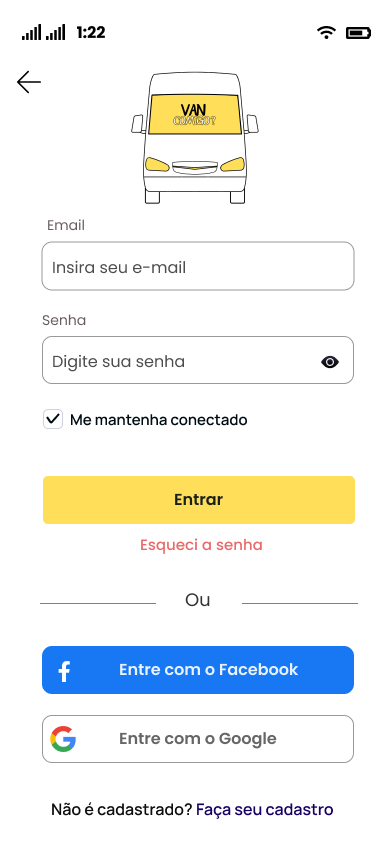
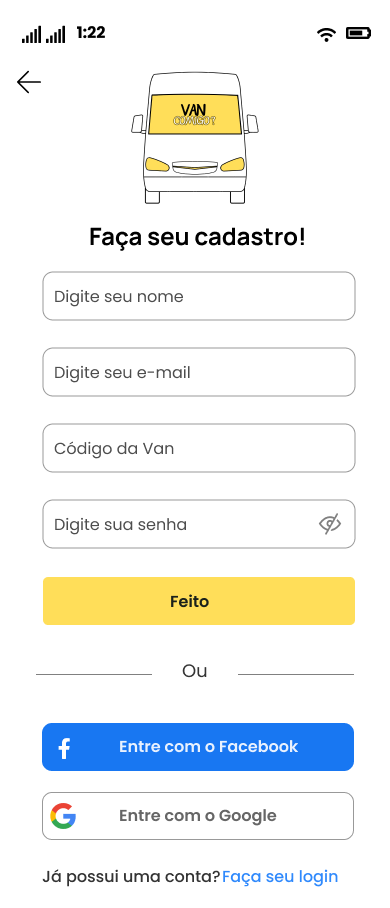
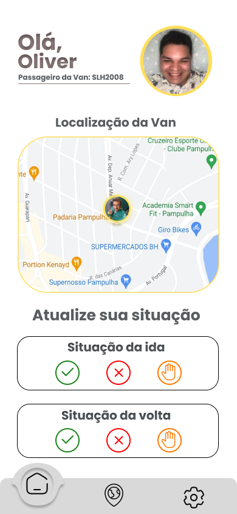
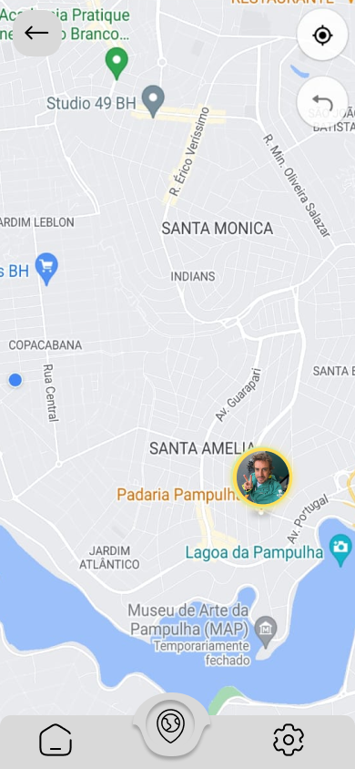
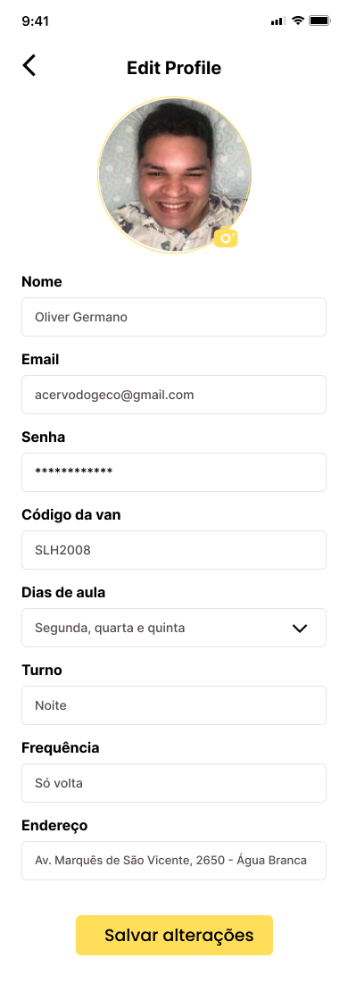
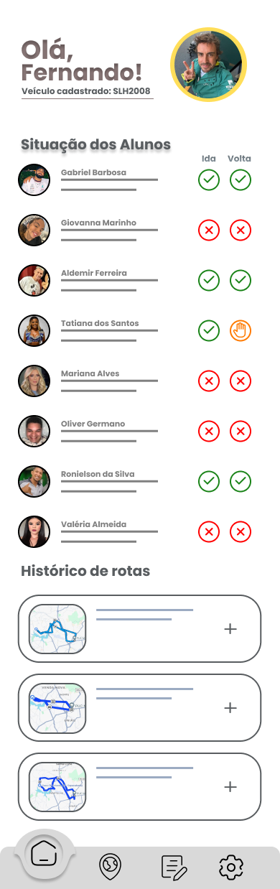
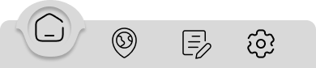
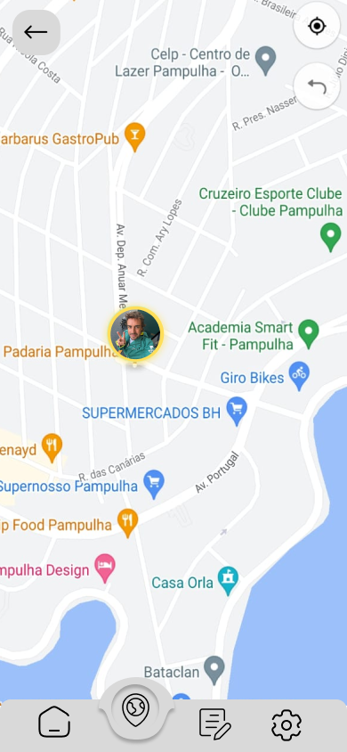
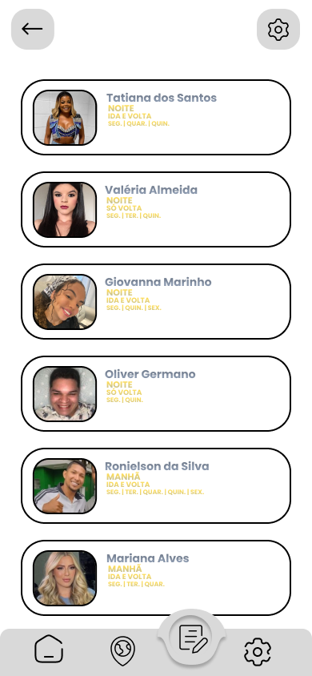
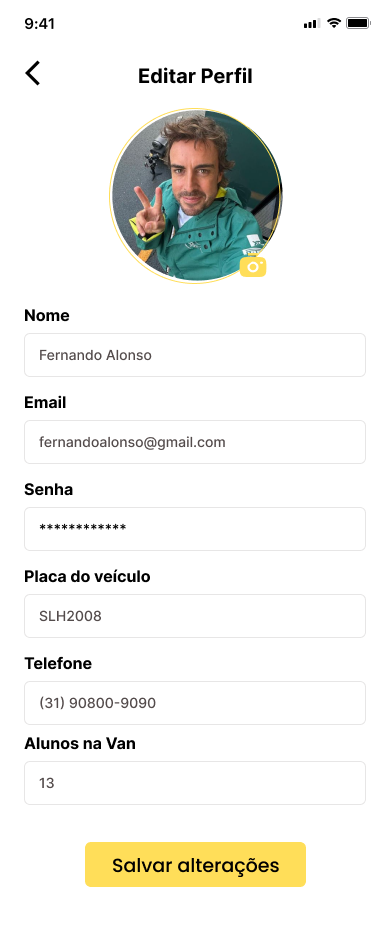

# Projeto de Interface

Pré-requisitos: <a href="2-Especificação do Projeto.md"> Documentação de Especificação</a>

Nessa sessão iremos apresentar nosso prototipo de interfaces do VanComigo e como serão os fluxos de interação com o usuário. Essa parte foi elaborada seguindo as especificações do projeto visando atender os requisitos do cliente e tornar nosso sistema eficaz para solucionar o problema de má gestão de rotas das vans universitárias.

## Diagrama de Fluxo

Para esse projeto, teremos dois fluxos de interação do usuário em relação ao sistema: o fluxo do usuário como motorista e como passageiro.

Apesar de que ambos utilizam a ferramenta com uma mesma finalidade, agilizar e facilitar a troca de informação sobre a presença nas aulas, eles possuem finalidades e permissões diferentes dentro do VanComigo.

## Wireframes

Para o VanComigo, elaboramos prototipos de todas as telas que serão desenvolvidas na aplicação, essas poderão sofrer alterações ou até mesmo adição de novas telas ao decorrer do processo de desenvolvimento.

### Tela Inicial
A tela inicial do aplicativo irá mostrar a logo do projeto enquanto o VanComigo está inicializando a aplicação.

    

### Tela de Escolha
Nessa tela o usuário irá selecionar se vai utilizar o VanComigo como motorista ou como passageiro da van.

    

### Tela de Login
Ambas páginas de login, tanto de motoristas quanto passageiros, são similares. Aqui o usuário entrará com seu login e senha, tendo a opção de efetuar o login com o Facebook ou com Google, além do seu email.

    

### Tela de Cadastro Aluno
Já na parte do cadastro, teremos algumas alterações dependendo do usuário. Quando um aluno é cadastrado além das suas informações básicas, ele terá que fornecer o Código da sua Van, que será a placa da mesma, para o sistema inserir ele na rota do motorista correto.

    

### Tela de Cadastro Motorista
 
 Enquanto no cadastro do motorista, incialmente, ainda não será pedido dados adicionais uma vez que todos os dados necessários serão informados dentro do própio aplicativo após o cadastro do usuário.

    

### Tela Home Aluno
Essa será a tela inicial que o aluno irá visualizar ao entrar no sistema, nela teremos as principais informações que buscamos com o VanComigo: mapa de atualização em tempo real para saber onde estar a van e botões para atualizar sua situação em relação a sua presença na aula.

    

### Menu de Escolhas Aluno

Para os alunos, nossa barra de navegação terá três opções: a home, mapa para ver a localização em tempo real e configurações.

    

### Mapa em Tempo Real Aluno

O aluno irá visualizar a localização em tempo real do motorista e poderá ver se eles está se proximo ou não de chegar em sua casa.

    

### Configurações Aluno

Nessa tela o aluno poderá realizar as configurações do seu perfil. Ele poderá escolher uma foto, editar seu nome, email, senha, código da van, os dias que ele irá na aula, o turno e colocar o seu endereço.

    

### Tela Home Motorista

Já a tela inicial do motorista ele terá de maneira fácil e intuitiva a relação dos alunos que irão para aula em determinado dia, além de ter o registro das suas rotas anteriores gravado.

    

### Menu de Escolhas Motorista

Já na barra de navegação do motorista terá uma opção a mais: gerenciar passageiros. Nessa aba ele poderar adicionar ou excluir passageiros da van.

    

### Mapa em Tempo Real Motorista

Nessa tela o motorista irá ativar sua localização em tempo real e os alunos vão poder acompanhar como a rota está sendo realizada.

    

### Tela de Gerenciar Alunos da Van

Nessa sessão o motorista terá a relação de todos os alunos que ele leva na van junto com suas informações relevantes como nome, turno, como é sua frequência (só vai, só volta, vai e volta na van) e quais dias da semana o aluno irá. Além de poder adicionar e excluir alunos da sua lista.

    

### Tela de Configurações do Motorista

Aqui o motorista poderá alterar todas as informações do seu perfil, tal como adicionar uma foto, alterar seu nome, email, senha, placa do veículo, telefone de contato e o número de alunos que cabe na sua van.

    

